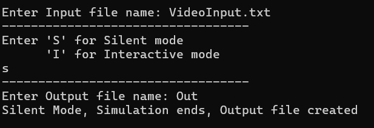

# Physiotherapy Centre Simulation

## Overview

This project simulates the scheduling and management of patients and resources in a physiotherapy centre. It models patient arrivals, treatments, waiting lists, cancellations, and rescheduling using a variety of data structures for efficient and realistic simulation.

---

## Table of Contents

- [Project Structure](#project-structure)
- [Data Structures Used](#data-structures-used)
- [Design Rationale](#design-rationale)
- [How to Build and Run](#how-to-build-and-run)
- [Input/Output Format](#inputoutput-format)
- [UML Class Diagram](#uml-class-diagram)
- [Screenshots](#screenshots)
- [Contributors](#contributors)

---

## Project Structure

- Source code: [`PyhsiotherapyCentre/`](PyhsiotherapyCentre)
- Input files: `input1.txt`, `input2.txt`, `input3.txt`, etc.
- Output files: Generated after simulation

---

## Data Structures Used

| Data Structure | File(s)                                                                                                                                  | Usage                                                              |
| -------------- | ---------------------------------------------------------------------------------------------------------------------------------------- | ------------------------------------------------------------------ |
| Linked Queue   | [`LinkedQueue`](PyhsiotherapyCentre/LinkedQueue.h)                                                                                       | For general patient and resource queues (FIFO order)               |
| Array Stack    | [`ArrayStack`](PyhsiotherapyCentre/ArrayStack.h)                                                                                         | For finished patients (LIFO order, easy pop for output)            |
| Priority Queue | [`priQueue`](PyhsiotherapyCentre/priQueue.h)                                                                                             | For late patients and in-treatment lists (sorted by priority/time) |
| Custom Queues  | [`M1Queue`](PyhsiotherapyCentre/M1Queue.h), [`M2Queue`](PyhsiotherapyCentre/M2Queue.h), [`MpriQueue1`](PyhsiotherapyCentre/MpriQueue1.h) | For specialized patient management (early, late, X-therapy, etc.)  |

---

## Design Rationale

- **Linked Queues** are used for patient and resource management to ensure efficient enqueue/dequeue operations and dynamic memory usage.
- **Array Stack** is used for finished patients to allow easy output in reverse order if needed.
- **Priority Queues** are used for late patients and in-treatment lists to always process the most urgent (highest priority) patient/resource first.
- **Custom Queues** (e.g., `M1Queue`, `M2Queue`, `MpriQueue1`) extend basic queue functionality to handle domain-specific logic such as treatment latency, cancellation, and rescheduling, which are essential for realistic simulation of a physiotherapy centre.

These choices ensure that the simulation is both efficient and flexible, allowing for realistic patient flow and resource allocation.

---

## How to Build and Run

1. Open the solution [`PyhsiotherapyCentre.sln`](PyhsiotherapyCentre.sln) in Visual Studio.
2. Build the project.
3. Run the executable. You will be prompted to enter the input file name.
4. The simulation will run in either Silent or Interactive mode as selected.

---

## Input/Output Format

- **Input:** See sample files like [`input1.txt`](input1.txt), [`StressTestInput.txt`](StressTestInput.txt).
- **Output:** Results are written to a file specified at the end of the simulation, e.g., [`outstress.txt`](PyhsiotherapyCentre/outstress.txt).

---

## Input/Output Format

- **Input:** See sample files like [`input1.txt`](input1.txt), [`StressTestInput.txt`](StressTestInput.txt).

### Input Example

- **Output:** Results are written to a file specified at the end of the simulation, e.g., [`outstress.txt`](PyhsiotherapyCentre/outstress.txt).

### Output Example

### Timestep Example

---

## UML Class Diagram

> **UML Class Diagram**
>
> Available in two formats:
>
> - [PDF Version](PyhsiotherapyCentre/assets/UML.pdf)
> - [SVG Version](PyhsiotherapyCentre/assets/UML.svg)

---

## Screenshots

> **Add screenshots of your application in action here.**
>
> 

---

## Screenshots

> **Add screenshots of your application in action here.**
>
> 

---

## Contributors

-
-
- ***

## License

This project is for educational purposes.
